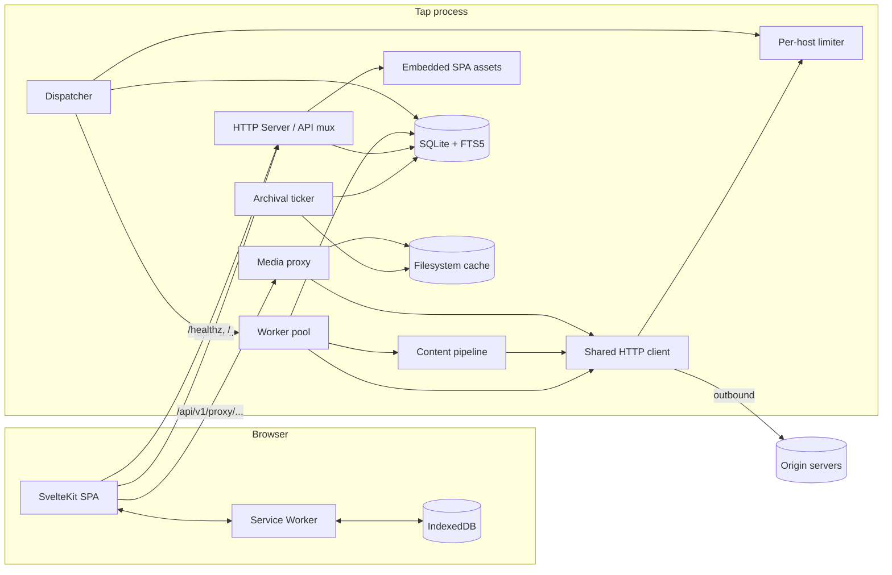
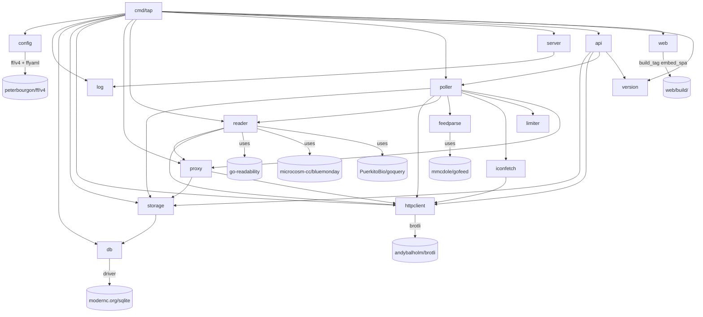

# Tap — Design

**Status:** authoritative as of 2026-04-28 (post-PR #26).
**Module:** `github.com/bcrisp4/tap`. **License:** Apache-2.0.

This document is reverse-engineered from the running code. The code is the
source of truth; where this doc and the code disagree, the code wins and
this doc has bugs. Plan files under `docs/superpowers/plans/` (gitignored)
and merged PRs #1–#26 are the recovered "why" behind the decisions.

---

## 1. Purpose and scope

Tap is a self-hosted RSS / Atom / JSON Feed reader. It runs as a single
statically-linked Go binary. It owns one SQLite file for relational state
and one filesystem directory for the media-image cache. It serves a REST
API under `/api/v1/` and an embedded SvelteKit SPA at every other path.

The SPA is the only intended client. There is no public API contract
beyond what the SPA needs; third-party integrations, Fever / Google Reader
compatibility, and i18n are out of scope. There is no authentication
layer in v1 — Tap assumes the operator restricts network access (loopback
default, Tailscale, or a reverse proxy with auth in front). The schema
carries `user_id` columns and a default user is seeded at id=1, so a
multi-user retrofit is possible without a destructive migration, but no
v1 code exercises that path.

The deployment shape is a single OCI image (~7 MB compressed,
distroless/static base) plus one writable volume for the SQLite file and
the proxy cache. Tap does no outbound traffic except feed fetches,
article-content fetches when a feed is opted into the crawler, and image
fetches through the media proxy. There is no telemetry, no analytics, no
account system, no central service.

What Tap does, end to end: it polls subscribed feeds on an adaptive
schedule, deduplicates and ingests new entries, optionally extracts the
full article body for link-only feeds, sanitizes all HTML and rewrites
image URLs through an internal proxy, and exposes the result through a
REST surface that the SPA consumes online or offline (mutations are
queued in IndexedDB while offline and drained on reconnect).

---

## 2. Glossary

**Adaptive polling** — the per-feed `next_poll_at` formula that derives
the next poll time from how often the feed publishes. See §8.4.

**Crawler** — a per-feed boolean that, when set, causes the worker to
fetch each new entry's URL and run the content pipeline (extract → rewrite
→ sanitize) before commit, replacing the feed-provided summary with the
full article body.

**Dispatcher** — the single goroutine on a `time.Ticker` that, on every
tick, queries SQLite for due feeds and pushes their IDs onto an unbuffered
channel feeding the worker pool.

**Entry** — a single article ingested from a feed. Identified by
`(feed_id, hash)` where `hash` is computed from the feed-provided GUID, or
fall through to URL, or fall through to `(title, published_at)`.

**FTS5** — SQLite's built-in full-text search module. Tap uses it in
*contentless* mode, with INSERT / UPDATE / DELETE triggers on `entries`
maintaining a virtual `entries_fts` index.

**Junction dot** — the brand mark, a small filled dot at the
intersection of two schematic lines. The Klein Blue accent is reserved
for it. See §11.

**Klein Blue** — `#002FA7` on light themes, slightly desaturated on dark.
Used sparingly: links, focus rings, the brand mark.

**Media proxy** — `/api/v1/proxy/{token}`. All image URLs in extracted
article HTML are rewritten to point at this endpoint, which fetches and
caches origin bytes on demand. See §8.7.

**OPML** — the XML feed-list interchange format. Tap supports import and
export.

**Plan** — a self-contained implementation work-unit under
`docs/superpowers/plans/`. Plans 00–13 built v1; 14–18 closed the
post-v1 UX gap; 19–22 followed up on user feedback. Plan files are
gitignored.

**PollerError** — a structured error record `{feed_id, feed_title, error,
at}` kept in a 64-deep ring buffer in `RunState` and returned by
`/api/v1/system/status`. `feed_id == 0` means the error is process-wide
(archival sweep, dispatcher panic) rather than a single feed's fault.

**Poll factor** — `TAP_POLL_FACTOR`, a multiplier on the adaptive
interval. Lower values poll more often.

**Pre-pass** — Tap-specific HTML transforms run before the bluemonday
sanitizer policy. Strips 1×1 tracking pixels, removes iframes whose host
isn't on the embed allowlist, and resolves relative URLs against the
entry URL.

**RunState** — a mutex-protected counter store exposing `active_polls`,
`last_poll_at`, and `recent_errors` via the system-status endpoint.

**Singleflight** — `golang.org/x/sync/singleflight`, used by the media
proxy to coalesce concurrent misses for the same URL.

**SSRF guard** — a `Dialer.Control` callback on the shared HTTP client
that rejects connections to RFC1918, loopback, link-local, and ULA
addresses after DNS resolution. Defeats DNS rebinding.

**Tombstone** — `entry_tombstones(feed_id, hash)`. Recorded when the
archival sweep deletes a read+unsaved entry; consulted at insert time so
republished entries don't re-appear.

**Worker** — a goroutine in the fixed-size pool that handles one feed
end-to-end: HTTP fetch, parse, optional per-entry article extraction
(parallel via `errgroup`), and atomic commit.

---

## 3. Architecture overview

Tap is a single Go process. Two long-running goroutines (the dispatcher
and the daily archival ticker) run alongside the HTTP server. Every
component shares one `*sql.DB`, one `*http.Client`, and one `RunState`.



**Single process, four concurrent concerns.**

The HTTP server is stdlib `net/http`. `/healthz` is mounted by
`internal/server`. `/api/v1/proxy/` is mounted at the longest-prefix
slot by the media proxy handler. The rest of `/api/v1/*` is mounted by
the API multiplexer, which uses Go 1.22 method-aware patterns (e.g.
`PUT /api/v1/entries/{id}`, `PUT /api/v1/entries/read` — the literal
segment wins by ServeMux specificity). Every other path falls through
to the embedded SPA's `index.html` so the client-side router can pick
it up.

The poller dispatcher is one goroutine that ticks every
`TAP_POLL_INTERVAL` (default 60 s). It queries SQLite for feeds that are
due, pushes their IDs onto an unbuffered channel, and gates its own
backpressure naturally — when every worker is busy the send blocks, and
the dispatcher cannot over-claim. The worker pool is a fixed `Workers`
goroutines reading off that channel; each handles one feed end to end
(fetch → parse → optional per-entry extract via `errgroup` → commit) and
clears its in-flight marker in a `defer` so a panic doesn't strand a
feed permanently.

The archival ticker is a sibling goroutine that fires every 24 h and
runs two passes: it deletes read & unsaved entries older than
`TAP_ARCHIVE_DAYS` (recording tombstones), then walks the proxy cache
directory and unlinks files whose `mtime` is older than
`TAP_PROXY_CACHE_MAX_AGE`.

State lives in three places. Relational state is in SQLite (feeds,
entries, FTS5 index, tombstones, enclosures, icons, users, categories,
config kv); the file is exclusively the binary's because
`SetMaxOpenConns(1)` enforces a single writer and `_txlock=immediate`
forces every transaction to start with `BEGIN IMMEDIATE`. Image bytes
live in a sharded filesystem cache at `TAP_PROXY_CACHE_DIR` with a JSON
sidecar carrying `Content-Type` and ETag. Live counters (active polls,
last poll timestamp, ring of recent errors) live in process memory only;
`active_polls` is correct-after-restart because the in-flight set is
also in memory and a crashed-mid-poll feed gets re-dispatched on the
next tick (idempotent thanks to `UNIQUE(feed_id, hash)`).

The SPA is a SvelteKit application built with `@sveltejs/adapter-static`
and a `fallback: 'index.html'` so it boots as an SPA. It is compiled at
build time and embedded into the Go binary via `//go:embed`. A service
worker caches the app shell, runs stale-while-revalidate against
`/api/v1/entries*`, and cache-firsts every `/api/v1/proxy/*` URL. A
prefetch driver fetches up to 200 recent entries on boot and reads each
entry's HTML for proxy URLs, asking the service worker to warm them.
TanStack Svelte Query (v6, runes API) holds the in-memory cache; an
IndexedDB-backed persister survives reloads. Mutations made offline are
paused by `onlineManager`, dehydrated to IDB, and drained at boot or on
the next online event.

---

## 4. Subsystem dependency map

The graph reflects what each Go package imports at compile time and what
the running process composes at startup. Cycles would be enforced as a
compile error by Go; there are none.



The runtime compose-order is: load `config` → open `db` and run
migrations → construct `storage.Store` → build the shared
`httpclient.Client` → ensure the proxy HMAC secret in the `config` kv
table → build the `proxy` handler with its filesystem cache → build the
content `reader.Pipeline` (it needs the proxy's encoder for URL
rewriting) → build the `poller` (which owns the per-host limiter and
the `RunState`) → mount handlers on the `server` (proxy first at
`/api/v1/proxy/`, then `api.Mux` at `/api/v1/`, then `web.Handler` at
`/`) → start the poller goroutine → run the server. The single
ownership boundary worth naming is the `httpclient.Client`: the poller,
the content pipeline, the icon fetcher, and the media-proxy origin
fetcher all share the same instance, so the SSRF guard, brotli/gzip
negotiation, max-body cap, and DNS-rebinding defense are uniform across
every outbound request.

The build-time order is encoded in the Makefile and Dockerfile: build
the SPA with `npm ci && npm run build` first, copy `web/build/` to
`internal/web/build/` so `//go:embed` (active under `-tags embed_spa`)
can find it, then `CGO_ENABLED=0 go build`. The two-file split between
`internal/web/embed.go` (no tag, empty FS, placeholder HTML) and
`internal/web/embed_with_spa.go` (`//go:build embed_spa`, real
`//go:embed all:build`) exists so `go test ./...` works on a fresh
checkout where `web/build/` doesn't exist yet.

---

## 5. Data model

All persistent state lives in one SQLite database file. Pragmas are set
at connection time via the modernc DSN and re-issued defensively on
`*sql.DB` after `Open`:

```
PRAGMA foreign_keys = ON;
PRAGMA journal_mode = WAL;
PRAGMA busy_timeout = 5000;
```

The DSN also carries `_txlock=immediate` so every `BeginTx` starts with
`BEGIN IMMEDIATE`. `SetMaxOpenConns(1)` enforces a single writer; the
WAL mode lets readers proceed concurrently anyway.

Migrations live at `internal/db/migrations/*.sql` and are applied in
alphabetical order, each in its own transaction, with the filename
(minus `.sql`) recorded in `schema_version`. As of this writing two
files have shipped: `0001_baseline.sql` (creates `schema_version`) and
`0002_initial_schema.sql` (every table below). No subsequent schema
changes have landed; the v1 schema is what the system runs against
today.

### 5.1 users

```sql
CREATE TABLE users (
    id               INTEGER PRIMARY KEY,
    username         TEXT    NOT NULL UNIQUE,
    theme            TEXT    NOT NULL DEFAULT 'system',
    font             TEXT    NOT NULL DEFAULT 'serif',
    entries_per_page INTEGER NOT NULL DEFAULT 50,
    default_sort     TEXT    NOT NULL DEFAULT 'published_at',
    default_order    TEXT    NOT NULL DEFAULT 'desc',
    created_at       INTEGER NOT NULL DEFAULT (unixepoch())
);
INSERT OR IGNORE INTO users(id, username) VALUES(1, 'default');
```

A single seeded row at `id=1` is the only user; every API handler hard-
codes this id. The other columns are present so a multi-user retrofit is
non-destructive, but in v1 the SPA stores theme and font in
`localStorage`, not here — the columns are unwired.

### 5.2 categories

```sql
CREATE TABLE categories (
    id      INTEGER PRIMARY KEY,
    user_id INTEGER NOT NULL REFERENCES users(id) ON DELETE CASCADE,
    name    TEXT    NOT NULL,
    UNIQUE(user_id, name)
);
```

Deleting a category sets `feeds.category_id` to `NULL` (the FK on feeds
is `ON DELETE SET NULL`).

### 5.3 icons

```sql
CREATE TABLE icons (
    id        INTEGER PRIMARY KEY,
    hash      TEXT    NOT NULL UNIQUE,
    mime_type TEXT    NOT NULL,
    content   BLOB    NOT NULL
);
```

Favicons are content-addressable by SHA-256 hex. Multiple feeds from the
same site share one row (deduplication is by hash, not by URL).

### 5.4 feeds

```sql
CREATE TABLE feeds (
    id                      INTEGER PRIMARY KEY,
    user_id                 INTEGER NOT NULL REFERENCES users(id) ON DELETE CASCADE,
    category_id             INTEGER REFERENCES categories(id) ON DELETE SET NULL,
    icon_id                 INTEGER REFERENCES icons(id) ON DELETE SET NULL,
    title                   TEXT    NOT NULL,
    feed_url                TEXT    NOT NULL,
    site_url                TEXT,
    description             TEXT,
    etag                    TEXT,
    last_modified           TEXT,
    last_polled_at          INTEGER,
    next_poll_at            INTEGER,
    poll_interval           INTEGER NOT NULL DEFAULT 3600,
    error_count             INTEGER NOT NULL DEFAULT 0,
    last_error              TEXT,
    weekly_entry_count      INTEGER NOT NULL DEFAULT 0,
    crawler                 INTEGER NOT NULL DEFAULT 0,
    scraper_rules           TEXT,
    disabled                INTEGER NOT NULL DEFAULT 0,
    ignore_entry_updates    INTEGER NOT NULL DEFAULT 0,
    user_agent              TEXT,
    cookie                  TEXT,
    username                TEXT,
    password                TEXT,
    proxy_url               TEXT,
    disable_http2           INTEGER NOT NULL DEFAULT 0,
    allow_self_signed_certs INTEGER NOT NULL DEFAULT 0,
    created_at              INTEGER NOT NULL DEFAULT (unixepoch()),
    updated_at              INTEGER NOT NULL DEFAULT (unixepoch()),
    UNIQUE(user_id, feed_url)
);
CREATE INDEX idx_feeds_user_category ON feeds(user_id, category_id);
CREATE INDEX idx_feeds_next_poll ON feeds(next_poll_at)
    WHERE disabled = 0 AND error_count < 10;
```

The partial index on `next_poll_at` is the dispatcher's hot path; rows
that are disabled or have crossed the 10-error dormancy threshold are
not in the index, so the dispatcher's `WHERE` clause is index-covered.

`feeds` carries seven optional per-feed HTTP overrides
(`user_agent`, `cookie`, `username`, `password`, `proxy_url`,
`disable_http2`, `allow_self_signed_certs`). Defaults are `NULL` or `0`,
meaning "use the global default." The four credential-bearing columns
are tagged `json:"-"` on the `Feed` struct so they never appear in API
responses (see §10.3).

### 5.5 entries and FTS5

```sql
CREATE TABLE entries (
    id                INTEGER PRIMARY KEY,
    feed_id           INTEGER NOT NULL REFERENCES feeds(id) ON DELETE CASCADE,
    user_id           INTEGER NOT NULL REFERENCES users(id) ON DELETE CASCADE,
    hash              TEXT    NOT NULL,
    title             TEXT    NOT NULL,
    url               TEXT,
    comments_url      TEXT,
    author            TEXT,
    summary           TEXT,
    content           TEXT,
    published_at      INTEGER,
    reading_time      INTEGER NOT NULL DEFAULT 0,
    read              INTEGER NOT NULL DEFAULT 0,
    read_at           INTEGER,
    saved             INTEGER NOT NULL DEFAULT 0,
    saved_at          INTEGER,
    extraction_failed INTEGER NOT NULL DEFAULT 0,
    created_at        INTEGER NOT NULL DEFAULT (unixepoch()),
    changed_at        INTEGER NOT NULL DEFAULT (unixepoch()),
    UNIQUE(feed_id, hash)
);
CREATE INDEX idx_entries_user_unread ON entries(user_id, read, published_at DESC);
CREATE INDEX idx_entries_user_pub    ON entries(user_id, published_at DESC);
CREATE INDEX idx_entries_user_saved  ON entries(user_id, saved, saved_at DESC) WHERE saved = 1;
CREATE INDEX idx_entries_feed_pub    ON entries(feed_id, published_at DESC);

CREATE VIRTUAL TABLE entries_fts USING fts5(
    title, content,
    content=entries,
    content_rowid=id,
    tokenize='unicode61'
);
CREATE TRIGGER entries_fts_insert AFTER INSERT ON entries ...;
CREATE TRIGGER entries_fts_delete AFTER DELETE ON entries ...;
CREATE TRIGGER entries_fts_update AFTER UPDATE OF title, content ON entries ...;
```

`hash` is computed by `feedparse.EntryHash` from `feed_id` plus, in
order, GUID, link, or `(title, published_at)`. The cascade is robust to
re-titling when a stable GUID exists. `extraction_failed = 1` only when
a `crawler=1` feed produced an entry whose article fetch failed and the
worker fell back to the feed-provided summary; otherwise it is `0`.
`read` and `saved` are independent — a saved entry can be either read or
unread.

The unique-row index `(feed_id, hash)` is the duplicate-detection
contract for the polling commit path: `INSERT` collisions are silently
dropped (`isUniqueConstraint(err)` returns true, the worker continues),
which is what makes a re-dispatched poll idempotent.

The FTS5 virtual table is *contentless* (`content=entries`,
`content_rowid=id`) — the index references `entries` rather than
duplicating body text. The three triggers maintain the index across
every entry mutation.

### 5.6 entry_tombstones

```sql
CREATE TABLE entry_tombstones (
    feed_id    INTEGER NOT NULL REFERENCES feeds(id) ON DELETE CASCADE,
    hash       TEXT    NOT NULL,
    created_at INTEGER NOT NULL DEFAULT (unixepoch()),
    PRIMARY KEY (feed_id, hash)
);
```

Recorded by the archival sweep when an entry is permanently deleted, and
consulted by the worker before insert. Republished entries do not return.

### 5.7 enclosures

```sql
CREATE TABLE enclosures (
    id        INTEGER PRIMARY KEY,
    entry_id  INTEGER NOT NULL REFERENCES entries(id) ON DELETE CASCADE,
    url       TEXT    NOT NULL,
    mime_type TEXT    NOT NULL DEFAULT '',
    size      INTEGER NOT NULL DEFAULT 0,
    UNIQUE(entry_id, url)
);
```

Podcast / video / image attachments. Returned alongside the entry on
`GET /api/v1/entries/{id}`.

### 5.8 config

```sql
CREATE TABLE config (
    key   TEXT PRIMARY KEY,
    value TEXT NOT NULL
);
```

A single-row-per-key store for runtime-generated state. The only key
written today is `proxy_hmac_secret` (32 random bytes hex-encoded,
generated on first call to `proxy.EnsureSecret` and persisted via
`INSERT OR IGNORE`). The schema is deliberately permissive so future
secrets and small global state can land here without a migration.

### 5.9 schema_version

```sql
CREATE TABLE IF NOT EXISTS schema_version (
    version    TEXT PRIMARY KEY,
    applied_at INTEGER NOT NULL DEFAULT (unixepoch())
);
```

One row per applied migration; created idempotently by `Migrate` before
any migration runs.

---

## 6. Public APIs and interfaces

### 6.1 Wire envelopes

List endpoints return `{ "data": [...], "pagination": { "limit": N,
"offset": N, "total": N } }`. Single-resource endpoints return the bare
object. Errors return `{ "error": { "code": string, "message": string }
}` with the appropriate HTTP status. All timestamps are unix epoch
seconds (matching the schema).

The `data` field is always a JSON array — never `null` — even when empty,
so the SPA can render without nullability checks. Entry list responses
strip the `content` field on every row to keep payloads small; the SPA
fetches the full body via `GET /api/v1/entries/{id}` when the user opens
a reader.

### 6.2 HTTP routes

The API is mounted at `/api/v1/`. The following table is the complete
external surface; everything else is a 404. Patterns use Go 1.22's
method-aware ServeMux syntax; literal `/entries/read` wins over the
parametric `/entries/{id}` by ServeMux specificity.

Server-mounted, outside `api.Mux`:

| Method | Path                       | Returns                                              |
|--------|----------------------------|------------------------------------------------------|
| GET    | `/healthz`                 | `{"status":"ok"}` (always 200)                       |
| GET    | `/api/v1/proxy/{token}`    | image bytes (see §8.7) or 404 / 415 / 502            |
| GET    | `/{any non-API path}`      | embedded SPA (or placeholder HTML in test builds)    |

Mounted by `api.Mux`:

| Method | Path                              | Purpose                                                                                  |
|--------|-----------------------------------|------------------------------------------------------------------------------------------|
| GET    | `/api/v1/feeds`                   | list all feeds (alphabetical, NOCASE) with `icon_hash` joined; credentials redacted      |
| POST   | `/api/v1/feeds`                   | subscribe to a new feed; conflict on duplicate `feed_url`                                |
| POST   | `/api/v1/feeds/discover`          | given a webpage URL, return `<link rel=alternate type=application/{rss,atom,feed+json,json}>` candidates |
| GET    | `/api/v1/feeds/{id}`              | fetch one feed                                                                           |
| PUT    | `/api/v1/feeds/{id}`              | update mutable fields (title, category, crawler, scraper rules, all per-feed HTTP overrides) |
| DELETE | `/api/v1/feeds/{id}`              | unsubscribe (cascades to entries and tombstones)                                         |
| POST   | `/api/v1/feeds/{id}/refresh`      | nudge dispatcher: `next_poll_at = now`; 202 Accepted                                     |
| GET    | `/api/v1/categories`              | list categories                                                                          |
| POST   | `/api/v1/categories`              | create category                                                                          |
| PUT    | `/api/v1/categories/{id}`         | rename                                                                                   |
| DELETE | `/api/v1/categories/{id}`         | delete (feeds become uncategorised via `ON DELETE SET NULL`)                             |
| GET    | `/api/v1/entries`                 | list entries (filterable, paginated, content stripped)                                   |
| PUT    | `/api/v1/entries/read`            | bulk mark read; optional `feed_id` and/or `category_id`                                  |
| GET    | `/api/v1/entries/{id}`            | one entry plus `enclosures: []`                                                          |
| PUT    | `/api/v1/entries/{id}`            | update read / saved booleans                                                             |
| GET    | `/api/v1/search?q=...`            | FTS5 search across entries; content stripped                                             |
| POST   | `/api/v1/opml/import`             | accept an OPML 2.0 XML body, subscribe each `<outline xmlUrl=...>`; silently skips duplicates |
| GET    | `/api/v1/opml/export`             | download OPML 2.0 listing every feed                                                     |
| GET    | `/api/v1/system/status`           | `{ version, uptime_seconds, run_state: { active_polls, last_poll_at, recent_errors[] } }` |
| GET    | `/api/v1/icons/{hash}`            | favicon bytes; `Cache-Control: max-age=31536000, immutable`; honors `If-None-Match`      |

`GET /api/v1/entries` query parameters:

```
status      = unread | read | all                  (default unread)
saved       = true | false                         (default unset = either)
feed_id     = integer                              (default unset)
category_id = integer                              (default unset)
sort        = published_at | created_at            (default published_at)
order       = desc | asc | read_at                 (default desc)
limit       = integer                              (default 50)
offset      = integer                              (default 0)
```

The `order` parameter is overloaded. Legacy `asc` / `desc` drive the
sort direction. Plan 14's `read_at` value selects `ORDER BY read_at DESC
NULLS LAST` instead, used by `/history` to show entries newest-read-
first. Any other value yields a 400 `bad_query` so user input never
reaches the SQL builder.

### 6.3 Error codes

The API package emits a small enumerated set:

```
not_found          (404)  resource missing
bad_json           (400)  body did not parse as JSON
bad_query          (400)  invalid query param (e.g. malformed FTS5,
                          unknown order value)
missing_*          (400)  required field absent
duplicate          (409)  uniqueness violation (subscribe to a URL twice)
body_too_large     (413)  enforced by http.MaxBytesReader
bad_opml           (400)  OPML did not parse
fetch_failed       (502)  outbound fetch failed (discovery, OPML import)
read_failed        (502)  body read failed
internal           (500)  unhandled
```

Errors do not echo credentials, request bodies, or stack traces. Internal
errors are logged with full context but exposed only as
`{"error":{"code":"internal","message":"internal error"}}`.

### 6.4 CLI commands

`tap` accepts two subcommands and a root `--version`:

```
tap [-v|--version] [-c|--config <path>]
tap serve   ...flags from §12...
tap healthcheck [-u|--url <url>]
```

`tap serve` opens the database, runs migrations, builds every component,
mounts the HTTP routes, starts the poller goroutine, and blocks on
`Server.Run`. `tap healthcheck` issues a single GET against
`http://127.0.0.1:8080/healthz` (override via `--url` or `TAP_URL`) with
a 5 s timeout and exits non-zero on any non-2xx response or transport
error. It exists so the `distroless/static` image — which ships with no
shell, curl, or wget — can satisfy Docker's `HEALTHCHECK` directive.

There is no migrate-only subcommand and no OPML-import-from-CLI
subcommand; the design doc once mentioned both but they were never
implemented. OPML import goes through the API.

---

## 7. Internal module boundaries

Each `internal/` package has a single responsibility. The package
boundary is enforced by Go's import rules; the responsibility is
enforced by code review. This section documents what each package owns
and, equally important, what it must not do.

**`internal/config`** declares the `Config` struct and `RegisterFlags`.
It depends only on `peterbourgon/ff/v4`. It must not read environment
variables itself, parse YAML itself, or know about defaults beyond what
it passes to ff. It must not import any other Tap package — config is a
leaf.

**`internal/log`** wraps `log/slog` with two factory choices (`json`
vs `text`) and four levels. It must not be a global; loggers are passed
explicitly.

**`internal/db`** opens the SQLite database with the canonical pragmas
and runs migrations from an embedded FS. It owns the `*sql.DB`. It does
not know about any specific table. Migrations are append-only files in
`internal/db/migrations/`.

**`internal/storage`** is the only package that issues SQL. It exports
typed structs (`Feed`, `Entry`, `Category`, etc.) and a `Store` that
wraps `*sql.DB`. The `Feed` struct's credential fields (`Cookie`,
`Username`, `Password`, `ProxyURL`) carry `json:"-"` tags; this is the
defense-in-depth for credential redaction (see §10.3). The `Store`
exposes domain-specific methods like `ListDueFeeds`,
`CommitPollSuccess`, `CommitPollFailure`, `CommitPollNotModified`,
`BulkMarkRead`. It must not call `httpclient`, must not run business
logic on entries, and must not encode HTML.

**`internal/server`** is the `net/http` skeleton. It exposes `New`
(which mounts `/healthz`), `Mount` for late attachment, and `Run` (which
listens, serves, and performs a 30 s graceful shutdown when the parent
context cancels). It must not own routing logic for the API.

**`internal/api`** owns the v1 HTTP API. Handlers receive a `*storage.Store`,
the shared `httpclient.Client`, and the poller's `RunState` through
`Dependencies`. The package must not start goroutines, must not poll, must
not run the content pipeline. It is purely I/O glue: parse query, call
storage, serialise.

**`internal/httpclient`** is the shared `*http.Client`. It carries the
SSRF guard (rejecting RFC1918, loopback, link-local, ULA after DNS
resolution), brotli + gzip negotiation, the per-feed override merger
(`Options`), and the body-size cap. It must not know about feeds,
entries, or articles; it is a generic outbound client.

**`internal/limiter`** is a per-host semaphore with lazy-initialised
`sync.Map` storage. Used by the poller (feed and article fetches) and
by the media proxy origin fetcher to share politeness across both. The
default weight is 1 — strict serialisation per host.

**`internal/feedparse`** wraps `mmcdole/gofeed`. It produces normalised
entries, computes the dedup hash, and computes reading time with a CJK
script heuristic (see §8.2). It does not fetch HTTP, does not write to
storage.

**`internal/reader`** owns the content pipeline: `Extract` (CSS scraper
rules first, `go-readability` fallback), `RewriteMedia` (rewrites ``, ``, `<picture><source srcset>` to proxy URLs), and
`Sanitize` (a Tap pre-pass plus a configured bluemonday policy). It must
not know about feeds (no DB writes); it operates on raw HTML and an
article URL.

**`internal/proxy`** owns the media proxy: HMAC-signed token codec, the
filesystem cache (`<2-hex-shard>/<sha256-of-url>` plus `.meta`
sidecars), the singleflight coalescer, and the secret-bootstrap helper.
It must not import `internal/reader`. Other packages call its
`Encoder()` to embed proxy URLs into HTML; nothing else.

**`internal/iconfetch`** discovers a feed's favicon and hashes its
bytes for the `icons` deduplication contract. Calls `httpclient`, calls
`storage` to write through `SetFeedIcon`.

**`internal/poller`** composes everything for the scheduler. The
`Dispatcher` is one goroutine on a `time.Ticker`. The `Worker` handles
one feed at a time. `RunState` is the in-process counter. `Adaptive`
holds the pure `NextPollAt` function. `Archival` is the daily ticker. It
must not own HTTP routing, must not directly mount endpoints; it
exposes a `RunState` accessor that `api.Mux` consumes.

**`internal/web`** is the SPA embed. The package contains two files:
`embed.go` (no build tag, empty FS, returns a placeholder `/index.html`)
and `embed_with_spa.go` (`//go:build embed_spa`, real `//go:embed
all:build`). The split exists so `go test ./...` works on a fresh
checkout without `npm run build` having run. `make build` always passes
`-tags embed_spa`; `make test` does not.

**`internal/version`** holds a single `Version` string set via
`-ldflags`. Default `0.0.0-dev`.

**`cmd/tap`** is the only binary entry point. `main` calls `run(...)`
which composes everything in the order described in §4 and returns an
exit code. The package is testable: `run` takes `args`, `stdout`,
`stderr` explicitly, and `defaultHealthcheckProbe` is a swappable var so
the healthcheck subcommand can be exercised in unit tests without
spawning a server.

The frontend has its own boundaries:

**`web/src/lib/api/client.ts`** is the typed `fetch` wrapper. It
serialises and deserialises every endpoint's payload. No other module
issues a raw `fetch` to `/api/v1/*` (only the service worker and the
prefetch driver bypass it for cache-warming).

**`web/src/lib/api/queries.ts`** holds every TanStack Query
factory and mutation hook. Mutation factories are defined as `*MutationOptions(client)`
helpers so they can be registered as defaults on the QueryClient at
construction time; that registration is what lets paused-and-rehydrated
mutations refire on reconnect.

**`web/src/lib/api/cache-patch.ts`** has the cross-list optimistic-update
helpers (`patchEntryEverywhere`, `removeEntryEverywhere`). Every entry-
state mutation `onMutate`s through here so marking an entry read in
`/unread` updates the same row in `/history`, `/saved`, and `/search`
instantly. `onSettled` invalidates the same query keys to backstop the
optimistic patch in case it diverged.

**`web/src/lib/offline/online.ts`** owns the mutation-drain logic. The
boot path awaits the persister's `restored` promise, then calls
`drainPausedMutations(client)` which kicks `resumePausedMutations()`
explicitly — TanStack only auto-resumes on an offline → online
transition, but a user who is already online at boot also has paused
mutations waiting in IDB.

**`web/src/lib/offline/prefetch.ts`** is the warm-cache driver. On boot
(deferred 1 s) and on every `online` event it fetches a window of recent
entries, regexes proxy URLs out of each `content` field, and posts a
`{type:'prefetch-proxy', urls}` message to the service worker so the
worker can warm Cache Storage at concurrency 6.

**`web/src/service-worker.ts`** holds three caches: `tap-shell-<v>` for
the app shell (cache-first, version-bumped per build),
`tap-api` for `/api/v1/entries*` (stale-while-revalidate), and
`tap-proxy` for `/api/v1/proxy/*` (cache-first; the HMAC token URLs are
immutable). Mutations and non-GET requests pass through. Navigation
requests fall back to `index.html` so the SPA boots offline.

---

## 8. Business logic and key decisions

This is the longest section. Each subsection states the rule, the
constraint that forced it, and the alternatives that were rejected when
they are recoverable from plan files, commit history, or PR discussion.

### 8.1 Pure-Go static binary

Every backend dependency is pure Go. SQLite is `modernc.org/sqlite`, a
pure-Go port with full FTS5 support. `make build` sets `CGO_ENABLED=0`
and `-trimpath`. The Dockerfile final stage is `gcr.io/distroless/static-
debian12:nonroot`.

**Constraint:** the deployment unit is a single statically-linked binary
in a distroless image. The image must run unmodified on any Linux Go
targets, with no libc, no shell, no LD_LIBRARY_PATH. End users self-
host on heterogeneous hardware (Raspberry Pi, NAS, VPS) and need
predictable cross-compile.

**Rejected alternatives:** `mattn/go-sqlite3` was rejected on the CGo
constraint. Static-musl CGo was considered and rejected — it still
pulls libc, defeats the purpose, and complicates the cross-compile
matrix. Dynamic linking against system SQLite was rejected because it
breaks portability and adds an opaque deployment dependency. Plan 01
makes the call; Plan 13 cashes it in via the multi-stage Dockerfile.

### 8.2 Reading time with a CJK script probe

`feedparse.Minutes` strips HTML, scans the first 50 non-whitespace
characters for runes in the Han, Hiragana, Katakana, or Hangul Unicode
blocks, and switches the divisor accordingly: 200 chars/min for CJK,
200 words/min for everything else. The minimum is 1 minute.

**Constraint:** Japanese articles report 5× their actual reading time
under a naive word-count estimate (CJK orthography conveys roughly
five times the information per "word" boundary). The user surfaced this
as a v1 polish item in Plan 04.

**Rejected alternatives:** always word-count (the bug); using the feed's
declared `lang` (unreliable, frequently absent or wrong); a full-text
script ratio (overkill for a heuristic).

### 8.3 Per-host concurrency cap of 1

A per-host semaphore (`internal/limiter`), default weight 1, keyed by
hostname, is acquired before every outbound HTTP request: feed fetches,
article fetches inside the content pipeline, and origin fetches from
the media proxy. A feed and its images on the same CDN serialise
together.

**Constraint:** politeness. A single dispatcher tick that polls a feed
and extracts ten articles on the same host could otherwise emit eleven
concurrent requests, triggering rate limits and IP blocks.

**Rejected alternatives:** no limiter (risk of being blocked); a global
queue (would starve fast hosts behind slow ones).

### 8.4 Adaptive polling formula

`adaptive.NextPollAt` computes the next `next_poll_at` at the end of
every poll. Four ordered branches; the first match wins:

1. **`Retry-After` header set.** `next_poll_at = now + retry_after`.
   Reset `error_count = 0` — server-mandated backoff is not Tap's error.
2. **Poll failed (network, 5xx, parse error).** Increment `error_count`,
   then `next_poll_at = now + min(2^error_count hours, 24h)` (the
   `2^error_count` is capped via a shift-cap of 12 to prevent overflow).
   After 10 consecutive failures the partial index `idx_feeds_next_poll`
   excludes the row entirely and the feed is dormant until a
   manual refresh reopens it.
3. **`Cache-Control: max-age` (or `Expires`) on a 2xx / 304.** Compute
   the adaptive interval per branch 4, then floor it: `interval =
   max(adaptive, max_age)`. The hint is asserting the response will
   not change before then; polling sooner wastes bandwidth.
4. **Normal case.** `interval = (7 days / weekly_entry_count) /
   poll_factor` if the feed has produced any entries in the last week,
   else 24 h. Clamp `[15 m, 24 h]`. Reset `error_count = 0`.
   `weekly_entry_count` is recomputed in the same transaction as the
   poll commit (`SELECT COUNT(*) FROM entries WHERE feed_id = ? AND
   created_at > unixepoch() - 7*86400`).

**Constraint:** different feeds publish at very different cadences and
Tap should not poll an active news source once a day or a quiet personal
blog once a minute. Conditional GET (ETag / If-Modified-Since) handles
the bandwidth side; the schedule is what handles the freshness side.

**Rejected alternatives:** fixed interval per feed (ignores feed
velocity); pure exponential backoff on success / failure (ignores
publication cadence); no ceiling (dormant feeds drift to months
between polls).

### 8.5 The dispatcher / worker split with backpressure

The dispatcher runs `time.NewTicker(PollInterval)` and on every tick
calls `ListDueFeeds(ctx, now, Workers*2, exclude)`. The exclude set is a
snapshot of an in-memory `sync.Map` of currently-in-flight feed IDs.
Claims are sent on an unbuffered channel; workers block until they
receive. When every worker is busy the dispatcher's send blocks, and it
cannot over-claim. Once a worker accepts a feed ID, the dispatcher marks
it in-flight; the worker `defer`s `Clear(id)` so a panic doesn't strand
the feed permanently.

**Constraint:** the schedule is the `feeds` table itself, not a separate
queue. Any in-memory queue has a stale-on-restart problem; storing the
queue in SQLite avoids that, and the dispatcher's claim query plus the
in-flight set is enough coordination. A poll is idempotent (`UNIQUE(feed_id,
hash)` blocks duplicates), so a re-dispatch after a crash is safe.

**Rejected alternatives:** an explicit `polls` queue table (extra
complexity, no win because the schedule and the queue would carry the
same information); a buffered channel (would let the dispatcher over-
claim and starve other feeds when one feed runs slow).

### 8.6 Per-entry article extraction in parallel

When `feed.crawler = 1`, the worker walks the new-entries list and runs
`Extract → RewriteMedia → Sanitize` on each one. Up to 8 article fetches
run concurrently per feed via `errgroup`. On per-entry failure (network
timeout, parse error) the entry is committed with `content` set to the
feed-provided summary and `extraction_failed = 1`.

**Constraint:** link-only feeds (Hacker News, newsletters) need full-
content extraction to be readable in Tap. But extraction is CPU-heavy
and high-latency, so it must be opt-in — feeds that already publish full
content shouldn't pay for it. And one bad article must not fail the
poll for the whole feed, because that would punish the user for an
upstream extractor bug.

**Rejected alternatives:** always-on extraction (unacceptable latency
for full-content feeds); fail-the-poll on extraction failure (loses
entries); silently dropping failed entries (worse UX than a degraded
entry with the summary).

### 8.7 Media proxy

Article images go through `/api/v1/proxy/{token}` rather than direct
origin URLs. The token format is

```
token = base64url(source_url) + "." + hex(hmac_sha256(secret, source_url))[:16]
```

The HMAC uses a 256-bit secret stored at `config.proxy_hmac_secret`
(generated on first call to `proxy.EnsureSecret` if absent, persisted via
`INSERT OR IGNORE`). The signature is the first 16 hex chars (64 bits)
of the full HMAC — enough collision resistance for a single secret with
no rotation. Tokens have no expiry; rotating the secret invalidates
browser caches but not the on-disk cache.

The cache directory layout is `<TAP_PROXY_CACHE_DIR>/<2-hex-shard>/
<sha256-hex-of-source-url>` plus a `.meta` sidecar holding the origin
`Content-Type` and `ETag`. Eviction is two-layered: an inline size pass
on every miss when total bytes would exceed `TAP_PROXY_CACHE_MAX_BYTES`
(evict by oldest mtime), and a daily age pass run by the archival
ticker. Concurrent misses for the same URL coalesce through
`golang.org/x/sync/singleflight`. Origin response MIME must match the
allowlist `image/jpeg, image/png, image/gif, image/webp, image/avif,
image/svg+xml`, otherwise 415.

Outbound `Cache-Control` is `public, max-age=2592000` (30 days). The
ETag is the origin's if present, otherwise the SHA-256 of the body
(weak); `If-None-Match` returns 304.

**Constraints (three, all named in Plan 06):** privacy — origin sites
see only Tap's IP, never the user's browser; mixed-content fix —
HTTP-only image URLs work even when Tap is served over HTTPS; offline
reading — pre-loaded entries can have their proxy URLs cached by the
service worker.

**Rejected alternatives:** no proxy (privacy regression, mixed content,
no offline images); JWT signatures (overkill, larger tokens); SQLite-
blob cache (extra schema, no win — filesystem is the right tool, and
eviction is simpler with `stat` + `unlink`); URL expiry (would force
periodic re-rendering of every entry's HTML; the secret-rotation lever
is the equivalent capability, used rarely).

### 8.8 SSRF guard with explicit allowlist

`httpclient.newSSRFControl` runs as a `Dialer.Control` callback after
DNS resolution, before TCP connect. It rejects loopback, RFC1918,
link-local, and ULA addresses. Two escape hatches: `TAP_ALLOW_PRIVATE_NETWORKS=true`
disables the check entirely, and `TAP_ALLOWED_HOSTS` accepts a list of
hostname suffixes and CIDR blocks that bypass the check (e.g.
`marlin-tet.ts.net,10.0.0.0/24` for Tailscale-resident feeds). Suffix
matching is dot-boundary; CIDR matching uses `net.ParseCIDR`. Loopback
is **not** opened by the suffix path — only by `AllowPrivate`.

**Constraint:** Tap users routinely run on a private network (Tailscale,
home LAN) and subscribe to feeds on that same network. A blanket RFC1918
block makes this use case impossible, but a blanket allowlist invites
SSRF. The dual-layer (suffix for hostnames you control, CIDR for IP
ranges you control) is the minimum granularity that covers both.

**Rejected alternatives:** allowlist-only by default (defaults are too
permissive; SSRF is a known browser-side and feed-side attack vector);
CIDR-only (Tailscale uses MagicDNS-resolved hostnames, often resolved
late by the Go DNS resolver); no bypass (Tailscale users can't use Tap).

### 8.9 Sanitizer split: bluemonday + Tap pre-pass

The sanitize stage runs in two passes. First, a Tap-specific pre-pass
on the parsed `goquery` DOM: drops 1×1 tracking pixels, drops `<iframe>`
elements whose `src` host isn't on the embed allowlist, and resolves
relative `href`/`src`/`srcset` against the article URL (img and source
URLs are already absolute proxy URLs by this point, so the relative-
URL resolution applies to non-media references). Second, the configured
`bluemonday` policy: a ~50-tag content allowlist plus media tags; a
URL-scheme allowlist of `http`, `https`, `mailto`, `tel`, with `data:`
allowed only for image MIME types; `<script>` and `<style>` removed at
parse time; `on*` handlers stripped (none are in any allowlist). The
default iframe host allowlist is `youtube.com, youtube-nocookie.com,
vimeo.com, bandcamp.com, soundcloud.com, spotify.com, twitch.tv,
dailymotion.com`; `TAP_IFRAME_ALLOWLIST` overrides it.

The summary fallback for `extraction_failed = 1` runs through the
sanitizer too — Tap never stores unsanitized HTML.

**Constraint:** bluemonday is an HTML allowlist policy engine and
assumes its input is parsed HTML; it can express tag/attribute/scheme
allowlists but it can't reason about "this iframe's `src` host belongs
to a trusted embed CDN" or "this `` is a 1×1 tracking pixel,"
which are both Tap-specific concerns. The pre-pass owns the host-
matching and the heuristic strip; bluemonday owns the structural safety.

**Rejected alternatives:** bluemonday alone (no iframe host policy, no
pixel strip, no relative-URL resolution); a hand-rolled allowlist
sanitizer (bluemonday already exists, is well-maintained, and is OWASP-
aligned).

### 8.10 Tombstones for re-imports

The archival sweep deletes entries where `read = 1 AND saved = 0 AND
created_at < unixepoch() - TAP_ARCHIVE_DAYS * 86400`, recording
`(feed_id, hash)` in `entry_tombstones` in the same transaction. The
worker's insert path consults tombstones before `INSERT`, so an entry
that is republished (feed edit, backdate, Atom republish) does not
reappear.

**Constraint:** without tombstones a re-archived entry would re-appear
as unread, which destroys the "I already read this" trust model. With a
soft-delete (keep deleted rows forever, filter at read time) the
database accumulates dead rows indefinitely.

**Rejected alternatives:** soft-delete; no dedup at all (entries
re-appear in the UI). The tombstone pattern is borrowed from Miniflux.

### 8.11 Credential redaction

The `Feed` struct's `Cookie`, `Username`, `Password`, `ProxyURL` fields
carry `json:"-"`. The API never returns them. Writes flow through
dedicated request DTOs (`subscribeReq`, `updateFeedReq`) that *do*
honour these fields, so a user can populate them once and forget. The
SPA's edit form omits empty credential inputs from the PATCH body —
sending an empty string would clear stored creds — and the design doc
elevates this to a v1 invariant.

**Constraint:** v1 has no auth on the API. A peer with network access
to Tap could otherwise read every stored cookie, basic-auth credential,
and proxy URL via `GET /api/v1/feeds/{id}`. Defense-in-depth: even with
the loopback-default bind, no path through the API should expose
credentials.

**Rejected alternatives:** masked credentials (`***` placeholders) —
edit-form bugs (cycles of unmask-mask-unmask) and the user can't tell
whether anything is stored; encryption at rest with a separate key
(adds key management without solving the "API leaks them" problem).

### 8.12 Auto-mark-read on reader open

Plan 11 deliberately shipped no auto-mark-read; reading was manual via
`m`. Plan 16 inverted that: opening `/entry/{id}` fires
`useToggleRead(id, read: true)` in a `$effect` exactly once per entry
ID per page lifetime. A Set guards against re-fire so the user can
press `m` to unmark and the effect does not refire.

**Constraint:** real-world feedback after v1: "reading an entry in
isolation should count as reading it." The deliberate-review use case
that motivated Plan 11 turned out to be rarer than the user's normal
flow of opening, reading, and moving on.

**Rejected alternatives (Plan 11):** always-auto. **Rejected
alternatives (Plan 16):** scroll-to-mark (heuristic, fires on accidental
scroll); time-based (heuristic, breaks for fast readers); explicit-only
(the v1 default that the feedback inverted).

### 8.13 Cross-list optimistic updates

Every entry-state mutation calls `patchEntryEverywhere(qc, id, patch)`
in `onMutate`, which walks every cached entries-list query
(`['entries', ...]`, `['history', ...]`, `['search', ...]`, `['saved', ...]`)
and applies the patch in place. If the patch causes the entry to drop
out of a list — marking read on `/unread`, unsaving on `/saved` — it's
removed and `total` decremented. `onSettled` invalidates the same query
keys to backstop the optimistic patch; `onError` reverts and surfaces a
toast (`"couldn't sync — change reverted"`).

**Constraint:** marking an entry read on `/unread` must be reflected
instantly on `/history` even though those are different cache keys.
Without cross-list patching the user would see the same entry in two
places until a refetch.

**Rejected alternatives:** invalidate everything on every mutation (UI
flicker, network thrash); single-list mutations (the cross-list bug);
keep one big list (loses pagination semantics).

### 8.14 Offline mutation queue with persisted drain

TanStack's `onlineManager` auto-pauses mutations when the browser goes
offline. The persister (`@tanstack/query-persist-client-core` plus
`@tanstack/query-async-storage-persister` over `idb`) writes paused
mutations to IndexedDB on a 50 ms throttle; the dehydrate predicate is
`(m) => m.state.isPaused`. On boot, `+layout.svelte` awaits the
persister's `restored` promise before calling `drainPausedMutations(client)`,
which explicitly kicks `resumePausedMutations()`. The mutation factories
(`toggleReadMutationOptions`, `toggleSavedMutationOptions`,
`bulkUpdateMutationOptions`, `deleteFeedMutationOptions`) are registered
as defaults on the QueryClient at construction so rehydrated mutations
have a `mutationFn` to call. Plan 22 fixed both halves of this wiring;
without the defaults the rehydrated mutation has no function, and
without the explicit drain a user who is *already online at boot* never
gets the auto-resume that only fires on offline → online transition.

**Constraint:** the user marks ten entries read offline, closes the
tab, and reconnects two hours later. All ten mutations must persist
across the reload and drain to the server on reconnect, in order, and
the optimistic patches must roll back if the server rejects.

**Rejected alternatives:** no persistence (mutations lost on reload);
fire-and-forget at offline time (server rejects until reconnect); a
hand-rolled persistent queue (TanStack already has the primitive, use
it).

### 8.15 PollerError shape and `feed_id = 0` for process-level errors

`RunState` keeps a 64-deep ring buffer of `PollerError{feed_id,
feed_title, error, at}`. Plan 19 enriched it from a flat string to this
shape so the Settings UI can name the failing feed and link to its
page. A panic in the dispatcher's `runOne` is recorded with
`feed_id = 0` and `feed_title = ""`; the originating feed ID is preserved
in the error message for forensics. This distinction lets the SPA
render feed-level errors as linked rows (`/feeds/{id}`) and process-
level errors as plain text.

**Constraint:** the Plan 21 sidebar UI wanted to make per-feed errors
clickable. A flat string lost the feed ID; including it explicitly is
cheap, and treating panics as feed-id-zero (rather than omitting the
feed_id field) preserves a single shape for the SPA.

**Rejected alternatives:** separate error tables (schema bloat for an
in-process counter); omitted `feed_id` field on panics (forces the SPA
to handle two shapes).

### 8.16 OPML import is best-effort, export is full-fidelity

`POST /api/v1/opml/import` parses the body as OPML 2.0, walks every
`<outline xmlUrl=...>` and subscribes each one. Duplicate `feed_url`
collisions return `ErrConflict` from storage and are silently skipped;
any other error aborts the import. Categories are taken from the
parent `<outline title=...>` if present. The response is
`{"imported": N}`.

`GET /api/v1/opml/export` writes a single OPML 2.0 document with every
feed, grouped by category. The Go handler streams raw XML; no
intermediate structure.

**Constraint:** users routinely import OPML from Miniflux, NetNewsWire,
or Feedly exports. A duplicate URL is not an error worth aborting on —
the user's intent is "subscribe to all of these," and the user can
already see in the UI that the duplicate is already subscribed.

**Rejected alternatives:** all-or-nothing import (one duplicate aborts
the whole batch); per-row error reporting (UI surface that nobody
asked for; the silent-skip pattern matches every other reader the
user has used).

### 8.17 SPA build embed via two-file split

`internal/web/embed.go` (no build tag) declares an empty `embed.FS` and
a placeholder `Handler` that serves a tiny HTML page pointing at
`/api/v1`. `internal/web/embed_with_spa.go` (`//go:build embed_spa`)
declares the real `//go:embed all:build` and a handler that serves the
SvelteKit static output, falling back to `index.html` for unknown paths
so the client-side router can claim them.

**Constraint:** `go test ./...` must pass on a fresh checkout where
`web/build/` doesn't exist. A single `embed.go` with `//go:embed
web/build` would fail at compile time. Conditional `//go:embed` is not
expressible at runtime — the directive is compile-time. The two-file
split is the minimal solution; `make build` adds `-tags embed_spa`,
`make test` does not, `make test-all` does both.

**Rejected alternatives:** vendoring a stub `web/build/` into the repo
(noise, drift); a build-time codegen step (more moving parts);
unconditional embed (forces every contributor to have the Node toolchain
to run `go test`).

### 8.18 Local-by-default bind, no auth in v1

`TAP_LISTEN` defaults to `127.0.0.1:8080`. The Dockerfile overrides it
to `0.0.0.0:8080` because the container's network namespace is the only
"network access" available — there's nothing else on the loopback
interface that could collide. v1 ships no authentication: the operator
is expected to control network access via firewall, Tailscale, or a
reverse proxy that authenticates in front of Tap.

**Constraint:** the project's `Goals` include "self-contained
deployment" and "single binary"; bundling an auth system would multiply
the surface (sessions, rate limiting, password reset, recovery codes,
2FA) and contradict the simplicity goal. Loopback-default plus operator-
controlled exposure is the smallest design that doesn't accidentally
expose the API to the public internet.

**Rejected alternatives:** a built-in cookie/session auth (rejected for
v1; doesn't change the deployment shape but multiplies the surface
significantly); HTTP Basic with a config-file user (small, but still
adds password storage to a project whose value prop is "no central
service, no account").

### 8.19 Conditional GET on every poll

Every feed fetch sends `If-None-Match` (from `feeds.etag`) and
`If-Modified-Since` (from `feeds.last_modified`) when the columns are
set. A 304 response skips parsing entirely but still updates
`next_poll_at` via the normal-case branch.

**Constraint:** the median feed publishes infrequently; conditional GET
is the difference between a 100-byte 304 and a 50 KB 200 on every poll.
Etiquette and bandwidth.

**Rejected alternatives:** unconditional GET (wasteful, impolite). No
rejected alternative for *not* sending; the cost of always sending the
headers is negligible.

### 8.20 Theme and font as SPA-local state

Theme (`system | light | dark | sepia`) and font (`serif | sans`) are
stored in `localStorage` (`tap.theme`, `tap.font`) and applied via a
`theme-*` class on `<body>` plus a `data-tap-font` attribute on `<html>`.
The `users` table carries the equivalent columns from a multi-user
future, but v1 does not read or write them.

**Constraint:** instant theme switching on first paint, before any API
call, which means the SPA can't wait for `/api/v1/users/me` (which
doesn't exist yet anyway). `localStorage` is synchronous and lives at
the browser, which is the right home for per-device preferences.

**Rejected alternatives:** sync via API (forces the SPA to await an
API call before painting; flicker on first paint); cookie (sent on every
request for no benefit).

### 8.21 Universal sanitize+proxy for non-crawler feeds (Plan 15)

The content pipeline is split. Even feeds with `crawler=0` (full-content
feeds where extraction is unnecessary) run their feed-provided HTML
through `RewriteMedia` and `Sanitize` before commit. The result is that
every entry's `content` is final-form sanitized HTML with proxy URLs;
the SPA can `{@html ...}` it without a runtime sanitizer.

**Constraint:** users want copy-image-URL to work and for images to be
served via the proxy regardless of whether Tap extracted the article.
Without the universal pass, summary-only feeds had raw-origin image URLs
that bypassed the privacy/mixed-content/offline benefits of the proxy.

**Rejected alternatives:** runtime sanitization in the SPA (slow,
duplicates Go-side rules, hard to keep in sync); origin-URL images
(privacy regression, no offline images). Plan 15 made the call
explicitly.

### 8.22 Daily archival as one ticker, two passes

The archival ticker fires every 24 h. Each sweep first deletes
read-and-unsaved entries older than `TAP_ARCHIVE_DAYS` (with tombstones,
in the same transaction). Then it walks `TAP_PROXY_CACHE_DIR` and
unlinks files whose mtime is older than `TAP_PROXY_CACHE_MAX_AGE`. The
sweep is single-threaded; it does not race the poll workers beyond
brief write-transactions.

**Constraint:** archival is not a hot path. A daily sweep is enough; a
faster cadence wastes CPU and disk for no benefit. A single goroutine
keeps the archival code simple.

**Rejected alternatives:** per-feed archival (parallelism for no win,
since the bottleneck is SQLite writes); on-write eviction for the proxy
cache only (still need the DB sweep, so a second goroutine is wasted).

### 8.23 Single-file commit per poll

Successful polls commit in one `BEGIN IMMEDIATE` transaction:
`INSERT` every new entry (silently dropping `UNIQUE(feed_id, hash)`
collisions), recompute `weekly_entry_count`, then `UPDATE feeds` with
the new ETag, Last-Modified, `next_poll_at`, error_count, last_error,
weekly_entry_count, and `updated_at`. 304 commits skip the entry inserts
and only update the feed row. Failure commits update only the failure
fields.

**Constraint:** a worker must never publish a half-formed view: an
entry whose `content` is the unextracted summary, or a feed whose
`next_poll_at` has advanced but whose entries didn't land. The
`_txlock=immediate` DSN plus `SetMaxOpenConns(1)` makes the single-
writer pattern robust under SQLite's WAL.

**Rejected alternatives:** per-entry transactions (concurrent reads
would see partial state); two-phase commit (the single-writer model
makes 2PC unnecessary).

---

## 9. Security and privacy

### 9.1 Authentication and authorisation

There is none in v1. Every API handler treats the request as
authenticated as user_id 1 unconditionally. Network access is the only
gate: the binary binds to `127.0.0.1:8080` by default, the container
binds to `0.0.0.0:8080` (because the container's namespace is the
boundary), and operators are expected to put a reverse proxy with auth
in front of any public exposure.

This is documented to operators in the README and CLAUDE.md and is
called out in §8.18.

### 9.2 SSRF and DNS rebinding

Every outbound HTTP request goes through the shared `httpclient.Client`,
which carries a `Dialer.Control` callback that runs after DNS
resolution and before TCP connect. The callback rejects RFC1918,
loopback, link-local, and ULA addresses unless `TAP_ALLOW_PRIVATE_NETWORKS`
is set or the host matches `TAP_ALLOWED_HOSTS`. Because the check
happens on the resolved IP, a hostile DNS record returning `127.0.0.1`
on the second resolution does not bypass it.

Redirects are checked too: if a request is allowlisted via host suffix
(say, `marlin-tet.ts.net`) and the response is a 302 to a non-allowlisted
host, the redirect target is checked against the allowlist independently.

### 9.3 Credential handling

Per-feed credentials (`cookie`, `username`, `password`, `proxy_url`) are
stored in plaintext in SQLite. They are never returned by the API
(`json:"-"` on the struct). The SPA's edit form omits empty inputs from
the PATCH body so a user editing a feed without re-entering the cookie
doesn't accidentally clear it. Logs do not include request bodies, do
not echo credential values, and do not include feed cookies in error
output.

The proxy HMAC secret (`config.proxy_hmac_secret`) is also plaintext in
SQLite. It is never exposed; only the derived signature appears in URLs.

The database file at `TAP_DB_PATH` is not encrypted at rest. Operators
who need that should rely on filesystem-level encryption (LUKS, ZFS
encryption, Docker Desktop's encrypted volumes).

### 9.4 HTML safety

All entry `content` is run through the bluemonday allowlist plus the
Tap pre-pass before commit (§8.9). This is unconditional — even non-
crawler feeds get sanitized + proxy-rewritten content (§8.21). The SPA
trusts the server's output and uses `{@html}` directly. There is no
runtime sanitizer in the browser.

`<script>`, `<style>`, and `on*` event handlers are always stripped.
Resource attributes (`src`, `href`, `poster`, `data-*`) accept only
`http`, `https`, `mailto`, `tel`. `data:` URIs are only allowed for
image MIME types. `<iframe>` is allowed only for the embed-CDN host
allowlist (`youtube.com`, `vimeo.com`, …); `TAP_IFRAME_ALLOWLIST`
overrides.

The DOM walker has a maximum depth of 512 to defeat billion-laughs-style
expansion bombs in malicious feeds.

### 9.5 PII

The only personal data Tap holds is the user's subscription list,
read/saved state, and per-feed credentials. There is no analytics, no
telemetry, no third-party request beyond what the user's feeds direct
Tap to fetch. Origin servers see Tap's IP, never the user's browser
(via the media proxy). The user-agent identifies Tap by default
(`Tap/0.1 (+https://github.com/bcrisp4/tap)`); per-feed override is
available for sites that gate on the UA.

### 9.6 Audit logging

Logs are structured JSON to stdout (override to text via
`TAP_LOG_FORMAT=text`). Levels are controlled by `TAP_LOG_LEVEL`. Each
poll start, success, failure, and panic is logged with feed ID. There
is no separate audit log table; operators forward stdout to whatever
log aggregator they use. The `recent_errors` ring in `RunState` exposes
the most recent 64 poll failures via `GET /api/v1/system/status`.

### 9.7 Trust boundaries

Three boundaries:

1. **Browser ↔ Tap.** Treat the SPA as untrusted for the purpose of
   storage validation: the API never trusts SPA-supplied IDs without
   `WHERE user_id = ?`. Inputs are decoded as typed structs; unknown
   fields are dropped by `json.Decode`.
2. **Tap ↔ origin servers.** Treat origins as hostile. Body size capped,
   timeouts enforced, redirects bounded by net/http's default 10-hop
   cap, MIME types validated for the proxy, HTML sanitised on every
   entry.
3. **Tap ↔ disk.** SQLite file and proxy cache directory are owned by
   the binary's UID (65532, the distroless `nonroot` user in the
   container). No setuid, no shell-out, no `os.Exec`.

### 9.8 Threat model assumptions

The threat model that Tap defends against:

* a hostile feed serves malicious HTML or images: blocked by sanitiser
  + proxy + body-size cap + MIME allowlist;
* a hostile feed serves a 302 to localhost or a private CIDR: blocked
  by SSRF guard with redirect re-check;
* a hostile feed returns a billion-laughs entity expansion: bounded by
  the goquery-based pre-pass at depth 512 and by `MaxBytesReader`;
* an LAN attacker scrapes credentials via the API: blocked by the
  `json:"-"` redaction;
* a user pastes a feed URL with a private/local hostname: blocked by
  default; user opts into Tailscale/private networks explicitly via
  `TAP_ALLOWED_HOSTS`.

The threat model that Tap *does not* defend against:

* a hostile network operator MITMing Tap's outbound HTTPS — that's a
  PKI problem, not a Tap problem;
* a co-tenant on the host reading the SQLite file — filesystem
  permissions are the operator's responsibility;
* a user with shell access to the binary's host — out of scope; Tap
  has no shell, no `os.Exec`, and no privilege escalation surface, but
  any user with read access to `tap.db` reads everything.

---

## 10. Configuration

Tap reads configuration from three sources, merged in this order of
precedence (highest first):

1. **Command-line flags** (`--db-path /var/lib/tap/tap.db`).
2. **Environment variables** (`TAP_DB_PATH=/var/lib/tap/tap.db`).
3. **Config file** (YAML; default empty; override path via `--config
   /path/to/tap.yaml` or `TAP_CONFIG=/path/to/tap.yaml`; missing file
   is not an error).

The flag long-name is the lower-hyphen form of the env-var name
(`TAP_DB_PATH` → `--db-path`). The YAML key is the same long-name
(`db-path`). List-shaped knobs (`allowed-hosts`, `iframe-allowlist`)
accept either a repeated CLI flag or a YAML list; ff/v4's
`StringListVar` populates a `[]string`.

### 10.1 Knob table

| Variable | Flag | Default | Controls |
|---|---|---|---|
| `TAP_DB_PATH` | `--db-path`, `-d` | `./tap.db` | SQLite database file path |
| `TAP_LISTEN` | `--listen`, `-l` | `127.0.0.1:8080` | HTTP listen address |
| `TAP_LOG_LEVEL` | `--log-level` | `info` | `debug` / `info` / `warn` / `error` |
| `TAP_LOG_FORMAT` | `--log-format` | `json` | `json` / `text` |
| `TAP_POLL_INTERVAL` | `--poll-interval` | `60s` | dispatcher tick |
| `TAP_POLL_WORKERS` | `--poll-workers` | `4` | worker pool size |
| `TAP_POLL_FACTOR` | `--poll-factor` | `1.0` | adaptive multiplier (lower = poll more often) |
| `TAP_HOST_WEIGHT` | `--host-weight` | `1` | per-host concurrency cap |
| `TAP_USER_AGENT` | `--user-agent` | `Tap/0.1 (+https://github.com/bcrisp4/tap)` | default outbound UA |
| `TAP_HTTP_TIMEOUT` | `--http-timeout` | `20s` | overall outbound request timeout |
| `TAP_HTTP_MAX_BODY_BYTES` | `--http-max-body-bytes` | `10485760` | 10 MiB max response body |
| `TAP_ALLOW_PRIVATE_NETWORKS` | `--allow-private-networks` | `false` | disable SSRF guard entirely |
| `TAP_ALLOWED_HOSTS` | `--allowed-hosts` | (empty) | comma/list of hostname suffixes / CIDR blocks bypassing SSRF |
| `TAP_IFRAME_ALLOWLIST` | `--iframe-allowlist` | (built-in 8-host list) | override iframe `src` host allowlist |
| `TAP_ARCHIVE_DAYS` | `--archive-days` | `60` | read & unsaved entries older than this are archived |
| `TAP_PROXY_CACHE_DIR` | `--proxy-cache-dir` | `./tap-cache/` | filesystem cache directory for the media proxy |
| `TAP_PROXY_CACHE_MAX_BYTES` | `--proxy-cache-max-bytes` | `1073741824` | 1 GiB; oldest mtime evicted when exceeded |
| `TAP_PROXY_CACHE_MAX_AGE` | `--proxy-cache-max-age` | `720h` (30 d) | files older than this deleted by daily sweep |
| `TAP_PROXY_TIMEOUT` | `--proxy-timeout` | `10s` | origin-fetch timeout for proxy requests |
| `TAP_PROXY_MAX_BODY_BYTES` | `--proxy-max-body-bytes` | `10485760` | 10 MiB max body for proxy origin fetches |
| `TAP_CONFIG` | `--config`, `-c` | (none) | path to YAML config file |

The Dockerfile sets `TAP_DB_PATH=/data/tap.db`,
`TAP_LISTEN=0.0.0.0:8080`, `TAP_PROXY_CACHE_DIR=/data/cache/`,
`TAP_LOG_FORMAT=json`, `TAP_LOG_LEVEL=info`. `/data` is the declared
volume.

### 10.2 Per-feed overrides

Independent of the global config, each feed row carries optional
overrides applied per request: `user_agent`, `cookie`, `username`,
`password`, `proxy_url`, `disable_http2`, `allow_self_signed_certs`.
Defaults are `NULL` or `0` (use global). Set via `POST /api/v1/feeds`
or `PUT /api/v1/feeds/{id}`. The API never returns the credential-bearing
columns (§8.11).

---

## 11. External dependencies

### 11.1 Backend Go modules

* `modernc.org/sqlite` — pure-Go SQLite driver and library; the reason
  Tap is CGo-free. Full FTS5 support, WAL, foreign keys.
* `github.com/peterbourgon/ff/v4` (+ `ffyaml`) — flag/env/YAML config
  layering plus subcommand tree. Default-precedence is `flag > env > file
  > default`.
* `github.com/mmcdole/gofeed` — RSS 1.0/2.0, Atom, JSON Feed parser.
* `codeberg.org/readeck/go-readability/v2` — Mozilla Readability port,
  Apache-2.0, maintained by the Readeck project. Used as the fallback
  extractor when `feeds.scraper_rules` is absent.
* `github.com/microcosm-cc/bluemonday` — HTML allowlist sanitizer. Tap
  configures a custom policy and runs it after the Tap-specific pre-pass.
* `github.com/PuerkitoBio/goquery` — jQuery-style DOM walker. Used by
  the pre-pass (1×1 strip, iframe host filter, relative-URL
  resolution) and by the proxy URL rewriter.
* `github.com/andybalholm/brotli` — outbound `Accept-Encoding: br`
  decompression.
* `golang.org/x/sync` — `errgroup` for parallel article extraction,
  `semaphore.Weighted` for the per-host limiter, `singleflight` for the
  proxy origin fetcher.
* `golang.org/x/net` — `proxy` package for SOCKS5 per-feed proxy URLs.
* `github.com/stretchr/testify` — test assertions.

### 11.2 Frontend npm dependencies

* `svelte` 5.x — runes API, forced runes mode in `svelte.config.js`.
* `@sveltejs/kit` 2.x with `@sveltejs/adapter-static` — pre-rendered
  SPA fallback (`fallback: index.html`).
* `@tanstack/svelte-query` 6.x — runes API; consumers use
  `status.isLoading` directly, not `$status.isLoading`.
* `@tanstack/query-persist-client-core` and
  `@tanstack/query-async-storage-persister` — persistence primitives.
* `idb` 8.x — IndexedDB wrapper used as the persister backend.
* `lucide-svelte` — icon set; specifically the cog (Settings) and
  warning triangle (sidebar feed errors) added in Plan 21.
* `vite` 8.x.
* `playwright/test` — end-to-end tests under `web/tests/`.

### 11.3 Container base image

`gcr.io/distroless/static-debian12:nonroot`. No shell, no libc, no
package manager. The `tap healthcheck` subcommand exists because the
image has no `curl` or `wget` to invoke from `HEALTHCHECK`.

### 11.4 Infra requirements

A Linux host with persistent storage at the volume mount. The default
container declares `VOLUME ["/data"]` for `/data/tap.db` and
`/data/cache/`. No external services: no PostgreSQL, no Redis, no
queue, no object store, no SSO provider.

---

## 12. Operational concerns

### 12.1 Build, test, run

```
make web-build   # cd web && npm ci && npm run build
make web-stage   # rsync web/build/ → internal/web/build/
make build       # CGO_ENABLED=0 go build -trimpath -tags embed_spa
make test        # go test ./...                   (no SPA needed)
make test-all    # go test -tags embed_spa ./...   (also tests embed)
make run         # build then run
make image       # docker buildx build
make image-smoke # ./scripts/docker-smoke.sh
```

`make build` injects the version via `-ldflags "-X
github.com/bcrisp4/tap/internal/version.Version=${VERSION}"`, where
`VERSION` is `git describe --tags --always --dirty`.

### 12.2 Deployment shape

The release artifact is a single OCI image. The Dockerfile is
multi-stage: Node 22 alpine builds the SPA, Go 1 alpine builds the
binary with `-tags embed_spa`, distroless/static:nonroot ships it. The
expected image size is well under 25 MB; recent merges report ~6.5 MB.

A typical run:

```
docker run -d \
  -v /opt/tap:/data \
  -p 127.0.0.1:8080:8080 \
  ghcr.io/bcrisp4/tap:latest
```

The volume holds `/data/tap.db` (the SQLite file) and `/data/cache/`
(the proxy cache). Backup is `cp tap.db` while the binary is stopped, or
`VACUUM INTO` for a consistent live snapshot.

### 12.3 Observability

* **stdout logs** — structured JSON by default, levels
  `debug | info | warn | error`. Includes a startup line with version,
  listen address, db_path, and worker count, then per-poll start/finish
  lines with feed ID and outcome.
* **`/healthz`** — flat 200 / non-200 indicator. Used by the
  `tap healthcheck` subcommand and Docker's `HEALTHCHECK`.
* **`/api/v1/system/status`** — JSON: version, uptime seconds, active
  poll count, last poll timestamp, ring of recent errors. The Settings
  page renders this; the SPA's `StatsPanel` polls it.
* No metrics endpoint, no tracing, no profile endpoint. Adding a
  `/debug/pprof` mount would be a one-liner if needed.

### 12.4 Failure modes

* **Feed fetch failure** (timeout, DNS, 5xx, parse error): captured by
  the worker, recorded in `RunState`, written to `feeds.last_error`,
  and used by adaptive backoff. After 10 consecutive failures the feed
  is excluded from the dispatcher's index — manual refresh via the API
  or UI revives it.
* **Article extraction failure**: one attempt, no retry. Entry
  committed with `extraction_failed = 1` and the feed-provided summary
  as its `content`.
* **Worker panic**: caught by `recover()` in `Dispatcher.runOne`,
  recorded in `RunState` as a `feed_id = 0` error, the in-flight marker
  is cleared by `defer`, the worker continues with the next feed ID.
* **Dispatcher panic**: same as worker panic; the dispatcher's tick loop
  is itself panic-resistant.
* **DB write contention**: the only writer is the binary, so contention
  is between the dispatcher's claim query, worker commits, archival
  sweep, and the API mutation handlers. `_txlock=immediate` plus a
  5 s `busy_timeout` plus single-conn pool means contention shows up as
  serialised waits, not failed writes.
* **Proxy origin failure**: 404 to the browser, broken-image icon
  rendered natively. No placeholder image. Cache is not populated, so
  the next request will re-fetch.
* **Cache disk full**: inline size eviction at write time keeps the
  cache under `TAP_PROXY_CACHE_MAX_BYTES`. If the disk underneath is
  full for other reasons, writes will fail and the proxy returns the
  origin fetch directly to the browser without caching.

### 12.5 Graceful shutdown

`main` installs a `SIGINT`/`SIGTERM` handler. Shutdown sequence:

1. Server stops accepting connections; `srv.Shutdown(ctx)` drains in-
   flight requests with a 30 s deadline.
2. The dispatcher's `select` picks up `ctx.Done`, closes the worker
   channel, and waits for workers to finish their in-flight polls.
3. Database closes (`defer sqliteDB.Close()`).

If shutdown exceeds 30 s, in-flight HTTP requests are cancelled and the
process exits anyway.

### 12.6 SLOs

There is no formal SLO. The implicit targets are:

* `/healthz` p99 < 50 ms (returns a static string from in-memory state);
* `/api/v1/entries` p99 < 200 ms for typical feed counts (covered by
  the four indexes on `entries`);
* binary boot < 1 s on a warm SQLite file;
* polling round-trip per feed < 30 s p99 (the global request timeout
  is 20 s; extraction is bounded by per-host serialisation);
* image proxy cache hit p99 < 20 ms (single `read` from filesystem cache).

---

## 13. Brand and visual identity

The brand is documented inline because the SPA encodes it in CSS tokens
and SVG components and the doc reader needs the rationale.

**Name and metaphor.** *Tap* is the electrical-engineering term — a
junction on a wire that draws a clean copy off a main line without
interrupting it. The product aggregates many feeds into one
chronological stream, exactly what a signal tap does. The name reads
on two levels: the EE term and the everyday gesture of tapping a screen.
Avoid imagery suggesting faucets or plumbing.

**Junction dot.** A small filled dot at the intersection of two
schematic lines, marking an electrical connection. The dot is the
load-bearing detail of the brand. Variants:

* primary mark / favicon / app icon — a T-junction (the letter T
  doubles as a schematic tap; the junction is the dot under the
  crossbar);
* wordmark — lowercase `tap` in geometric sans-serif with the period
  rendered slightly larger and heavier so it reads as both a period
  and a junction dot;
* hero — three vertical branches rising from one main line ("many
  sources, one stream").

**Klein Blue.** Approximately `#002FA7`. Used sparingly: links, focus
rings, the junction dot, the SPA's selection highlight. If it appears
more than three times on one screen, something is wrong. On dark, the
accent is desaturated (`#5A7FDC`) for AA contrast.

**Themes.** `light` (off-white background, near-black text), `dark`
(near-black background, off-white text), `sepia` (warm cream `#F4ECD8`,
dark brown text), `system` (track `prefers-color-scheme`). All three
themes retain Klein Blue. The font toggle is `serif | sans` (Source
Serif 4 / Inter Tight). Theme is stored in `localStorage`, applied via
a `theme-*` body class, and switches without reload.

**Layout.** Content is the interface; chrome recedes. Single-column
reading view by default, 65–72 ch measure, line height 1.6–1.7,
generous whitespace. Sentence case throughout, never all caps. No
engagement metrics, no view counts, no share badges. Animation is
minimal and functional — fade and slide for state transitions, never
decorative. Iconography is line-based, thin strokes, rounded caps.

---

## 14. Frontend surface

### 14.1 Routes

| Route | What it renders |
|---|---|
| `/` | unread "river"; desktop sidebar + top bar, mobile tab bar; multi-select, bulk mark-read, manual refresh, keyboard nav |
| `/history` | newest-read-first; passive view (no keyboard nav); `?status=all&order=read_at&limit=100` |
| `/saved` | starred entries regardless of read state; `?status=all&saved=true&limit=100` |
| `/search?q=...` | FTS5 search; URL-synced query, 250 ms debounce, 2-char gate |
| `/settings` | theme + font controls; system status panel |
| `/feeds/add` | discover-then-subscribe flow |
| `/feeds/[id]` | feed detail; recent entries (compact density); edit / refresh / delete (type-to-confirm) |
| `/entry/[id]` | reader; auto-mark-read on open; swipe to next/prev (mobile); `m`/`s`/`v`/Esc bindings |
| `/+error.svelte` | branded 404 / 5xx |

Plan 14 added `/history` and dropped `/all`; the doc's pre-Plan-14
table is now stale.

### 14.2 Service worker caches

* `tap-shell-<version>` — app shell (hashed JS/CSS/fonts), cache-first,
  version bumped per build.
* `tap-api` — `/api/v1/entries*`, stale-while-revalidate.
* `tap-proxy` — `/api/v1/proxy/*`, cache-first (HMAC tokens are
  immutable).

GET-only caching; mutations and non-GET requests pass through.
Navigation requests fall back to `index.html` when origin is unreachable
so the SPA boots offline.

### 14.3 Prefetch driver

On boot (deferred 1 s) and on every `online` event, `prefetchRecent`
fetches a window of recent entries (200 on boot, 50 on reconnect),
pulls the full body via `GET /api/v1/entries/{id}` (since list views
strip `content`), regexes proxy URLs out of each `content` field
(`/\/api\/v1\/proxy\/[A-Za-z0-9_\-=.]+/g`), and posts a
`{type:'prefetch-proxy', urls}` message to the service worker. The
worker fetches at concurrency 6 (matching Chrome's HTTP/1.1 default).
Per-entry URL cap is 32. Failures are silent; the warm path is best-
effort.

### 14.4 Mutation defaults and offline replay

The QueryClient is constructed with four registered mutation defaults
(`toggleReadMutationOptions`, `toggleSavedMutationOptions`,
`bulkUpdateMutationOptions`, `deleteFeedMutationOptions`). The persister
uses `idb` to write paused mutations to IDB on a 50 ms throttle; the
dehydrate predicate is `(m) => m.state.isPaused`. On boot,
`+layout.svelte` awaits `restored` then calls
`drainPausedMutations(client)`. See §8.14.

### 14.5 Interactions

* **Swipe gestures (mobile)**: in the reader, right-swipe = previous
  entry, left-swipe = next. Threshold 60 px horizontal; vertical-to-
  horizontal ratio 1.5. Multi-touch is rejected (a second finger
  cancels the gesture; this was a Plan 18 Copilot fix).
* **Keyboard shortcuts (desktop)**: `j`/`↓` next, `k`/`↑` previous,
  `m` toggle read, `s` toggle saved, `o`/Enter open, `v` view original,
  `/` go to search, `?` toggle hotkeys modal, Esc close reader.
  Suppressed inside form controls and contenteditables.
* **Mark-as-read**: auto-on-open in the reader (Plan 16), explicit per-
  row button or `m` in the river.
* **Refresh**: explicit button on `/`. No pull-to-refresh.
* **Pagination**: explicit `limit`; no infinite scroll.
* **Multi-select bulk-read**: shift-click enters multi-select; the bulk
  action strip surfaces mark-read and clear-selection.

---

## 15. Current gaps

This section is deliberate. Tap is shipping software — nothing in here
should be inferred as an active blocker, but a future maintainer
shouldn't pretend any of these are the intended end state.

* **No authentication.** The API has no auth and no per-user scoping
  beyond the hard-coded user_id 1. Multi-user support is schema-ready
  (every row has a `user_id`) but not wired anywhere in handlers, the
  SPA, or migrations beyond the seed row. See §8.18 and §9.1.
* **Theme/font columns on `users` are unwired.** v1 stores them in
  `localStorage`. The columns exist but nothing reads or writes them.
* **`feeds.poll_interval`, `feeds.scraper_rules`, `feeds.ignore_entry_updates`**
  are present in the schema but the SPA does not surface them in any
  edit form. Operators can set them via direct SQL but not via the UI.
  The poller does honour `ignore_entry_updates` (when set, the worker
  skips re-saving an existing entry whose hash matches but whose
  fields changed); the schema documents this.
* **Categories are unsurfaced in the SPA.** The API supports them, the
  schema supports them, the OPML import path uses them — but no UI to
  list, create, rename, or assign to feeds. Subscribing through
  `/feeds/add` goes uncategorised by default.
* **`/api/v1/entries` filtering by category from the SPA**: the API
  accepts `category_id` but no SPA route binds it.
* **Per-feed manual re-extraction is not exposed.** When
  `extraction_failed = 1` the entry stays as-summary forever; there is
  no API or UI to retry.
* **No `MobileMorePanel` route binding.** The component
  `web/src/lib/components/MobileMorePanel.svelte` exists but isn't
  mounted anywhere; appears to be future work for the mobile chrome.
* **No metrics, no tracing.** Operations rely on stdout logs and
  `/api/v1/system/status`. A pprof mount or Prometheus endpoint would
  be a small addition.
* **`feeds.proxy_url` documents HTTP/HTTPS/SOCKS5** support but the
  HTTP client only wires the SOCKS5 path through `golang.org/x/net/proxy`;
  HTTP/HTTPS proxies via `Transport.Proxy` are
  not explicitly tested. **Constraint: unknown** whether this is
  intentional or a gap.
* **Per-host weight is global, not per-feed.** `TAP_HOST_WEIGHT`
  defaults to 1. There is no per-feed knob to bump a specific host's
  cap (e.g. for a fast CDN).
* **Cache rotation for the proxy HMAC secret is not exposed.** The
  secret can only be rotated by directly editing the `config` table.
  No API, no CLI subcommand. Token versioning is not in the format.
* **OPML import is in-process**: a giant OPML can block the API
  goroutine for a noticeable time. There is no streaming parse and no
  background-import path.
* **No backup or restore subcommand.** Backup is `cp tap.db` or
  `VACUUM INTO`. No `tap dump` / `tap restore`.

These items are recoverable from the code as written; they are not
recovered as `Constraint: unknown` because their presence is not the
result of a recovered design constraint, only of the v1 scope.

---

## 16. Inspirations and prior art

* **Miniflux** — architecture (single binary + SQL store), adaptive
  polling, sanitization rules, tombstone pattern, privacy approach.
* **NetNewsWire** — reader-pane typography choices, OPML interop
  expectations.
* **Reeder** — keyboard shortcuts (`j`/`k`/`m`/`s`).
* **Miniflux's go-readability fork** — Tap consumes `codeberg.org/readeck/go-readability/v2`
  (Readeck's actively-maintained fork) rather than vendoring Miniflux's
  copy.
