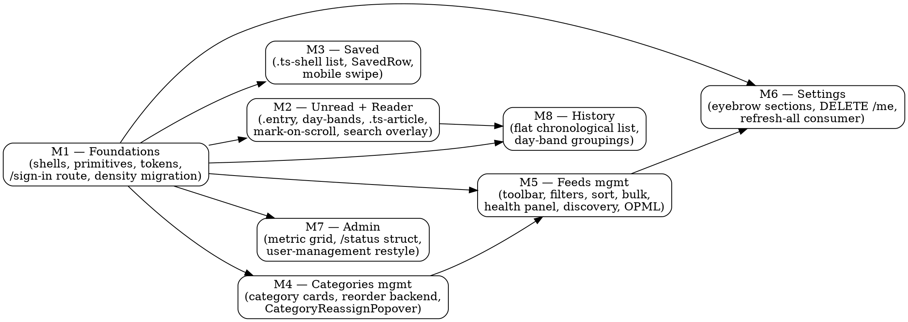

# UI Redesign — Implementation Dependency Graph

> Derived from the 8 approved plan PRs (#53–#60) and the umbrella spec at `docs/specs/2026-05-11-ui-redesign.md`. Documents what depends on what, when work can run in parallel, and which milestones lie on the critical path.

## Edges

| Edge | Why |
|---|---|
| **M1 → ALL** | Every other milestone consumes M1's primitives (`Button`, `Field`, `Segmented`, `Chip`, `Popover`, `Dialog`, `KbdChip`, `OtpInput`, `RecoveryCodesGrid`, `EmptyState`, `EntryRow`, `GroupHeading`, `FeedAvatar`), shells (`AppShell`, `TopTabs`, `AccountAvatar`, `AccountMenu`, `StatusFoot`, `MobileTopBar`, `MobileTabBar`, `MobileMoreSheet`), and shared libs (`lib/breakpoints.svelte.ts`, `lib/pollStatus.ts`, `lib/searchOverlay.svelte.ts`). M1 also migrates `lib/preferences.svelte.ts` density vocabulary and adds the `/sign-in` route. |
| **M4 → M5** | M5's per-row and bulk category-reassign actions both import `web/src/components/CategoryReassignPopover.svelte`, owned by M4. M5's Task 7 has a precondition grep that fails fast if M4 hasn't shipped. |
| **M5 → M6** | M6's "Refresh all now" calls `api.refreshSubscription(id)`, which is `PATCH /api/v1/subscriptions/:id` with `{ refresh_now: true }` — added by M5. M6's precondition grep fails fast if M5's flag isn't on the API. |
| **M2 → M8** | M8 imports `bucketByDay` from `web/src/lib/dayBands.ts`, owned by M2. M8's Task 4 precondition grep fails fast if M2 hasn't shipped. |

No other strict edges. M3, M7 only depend on M1. M2 only depends on M1. M4 only depends on M1.

## Graph (DOT)



## Phases (max-parallelism schedule)

```
Phase A  →  Phase B (4 parallel)  →  Phase C (2 parallel)  →  Phase D
  M1            M2  M3  M4  M7           M5     M8              M6
```

| Phase | Milestones | Why this phase | Concurrency |
|---|---|---|---|
| **A** | M1 | Nothing else can start; M1 ships every primitive | 1 |
| **B** | M2, M3, M4, M7 | All only depend on M1 | up to 4 |
| **C** | M5, M8 | M5 unlocked by M4 (popover); M8 unlocked by M2 (bucketByDay). Both can run in parallel once their predecessors land | up to 2 |
| **D** | M6 | Unlocked by M5 (refresh_now flag) | 1 |

## Critical path

```
M1 → M4 → M5 → M6
```

Four milestones in series. Anything in phases B/C that finishes before M4/M5/M6 doesn't shorten total wall-clock; anything that takes longer extends it. **The critical path is bounded by M4 → M5 → M6's combined duration**, plus M1.

Notable:

- M3, M7 are leaves and never gate anything. They can start in phase B and merge whenever ready without blocking downstream.
- M2 only gates M8. M2 + M8 together are a side branch off the critical path; they don't add to wall-clock unless they exceed M4 + M5 + M6.
- M8 is the smallest milestone (per the umbrella spec); it should be the first to finish in phase C.

## Rough effort signal

Plan line counts (a poor proxy but the best we have without estimating from feature surface):

| Plan | LoC | Backend? | Notes |
|---|---|---|---|
| M1 — Foundations | ~3900 | none | Largest. Primitive library + shells + Login rewrite + token migration. |
| M5 — Feeds mgmt | ~2700 | adds `refresh_now` to PATCH | Largest non-foundations. Bulk ops + discovery + OPML + health panel. |
| M4 — Categories mgmt | ~2900 | adds `position` column + reorder endpoint + mark-sub-read endpoint | Big Go test surface. |
| M2 — Unread + Reader | ~2000 | none | Day-band + mark-on-scroll + SearchOverlay UI. |
| M6 — Settings | ~1800 | adds `DELETE /api/v1/me` | Numbered eyebrow sections + new dialog patterns + N×1 refresh consumer. |
| M7 — Admin | ~1500 | extends `/api/v1/status` struct | Metric grid + restyled user-management. |
| M3 — Saved | ~900 | none | SavedRow + mobile swipe. |
| M8 — History | ~800 | none | Smallest. Pure frontend. |

## Recommended implementation orchestration

Given the dependency graph, the boring orchestration is:

1. **One implementer agent works M1 to completion + merge.** Block on this.
2. **Spawn four implementer agents in parallel: M2, M3, M4, M7.** Each works against the merged main. Use worktrees as the planners did.
3. **Once M4 is merged → spawn M5 implementer.** Once M2 is merged → spawn M8 implementer. M5 and M8 can run in parallel.
4. **Once M5 is merged → spawn M6 implementer.** M6 is the final milestone.

That's a maximum of 4 concurrent implementers (during phase B), tapering to 1 (during phase D). A reviewer agent of the same shape as the planning phase's reviewer can run alongside, picking up PRs as they appear and Copilot-polling per the prior workflow.

If maximum throughput is a goal, this schedule's wall-clock is `M1 + max(M2,M3,M4,M7) + max(M5,M8) + M6` ≈ M1 + M4 + M5 + M6 (since M4 likely dominates phase B and M5 dominates phase C).

If minimal team size is the goal (one implementer at a time), the linear order is: **M1 → M2 → M3 → M4 → M5 → M7 → M8 → M6** (satisfies all edges and minimises context switches between adjacent dependent pairs).

## Cross-milestone implementer briefing notes (carry-forward from reviewer)

Reviewer's final summary surfaced these gotchas that every implementer should know:

- **`PATCH /api/v1/subscriptions/:id`** decodes into `rawMap`, not a typed struct. Adding a typed field is silently dropped. Pattern is at `internal/api/subscriptions.go:285-315`. M4 + M5 plans document the correct pattern; M6 reuses via its refresh consumer.
- **`feed.feed_url` is absolute** — never prefix `https://`. M5 ships `originOf` / `displayUrl` / `formatAgo` helpers at `web/src/lib/url.ts` plus a `https://https://` regression sentinel.
- **`last_poll_at = 0` means "never polled"**, not falsy. Use `> 0` guards.
- **Write-handler MaxBytesReader** is `1<<20` with explicit `errors.As(&mbe)` → 413 mapping. Pattern in `internal/api/auth.go`.
- **Svelte 5: `$derived(get(auth))` is non-reactive.** Use `$derived($auth.user?.field)`.
- **Vitest mock-call introspection on Svelte components is unreliable.** Assert via parent's rendered DOM (`screen.findByText`), not `mock.calls[0][1].props`.
- **`entries` table has only `published_at` and `fetched_at`** — no `created_at`. M7 fixed; future schema work should double-check.

## Implementation team-lead checklist

When kicking off the implementation phase:

1. Confirm origin/main has the spec (`d1efce9`) plus all 8 plan commits.
2. Spawn the implementer + reviewer team. M1 implementer first; reviewer in parallel.
3. Establish the Copilot polling workflow per the planning-phase team's pattern (request via `gh pr edit --add-reviewer Copilot`, poll once/min for 15 min, consolidate with reviewer).
4. Each plan PR's content is now a path in `docs/superpowers/plans/`. Implementers read their own milestone's plan first; the cross-milestone briefing notes above belong in every implementer's prompt.
5. Use git worktrees for parallel implementers (`/home/ben.guest/Users/ben/src/tap-impl-mN`).
6. Squash-merge PRs with `--admin --delete-branch` for clean main history.
7. After each milestone merges, re-run `make test` and `pnpm --dir web test` on local main to catch any test regressions before the next milestone's worktree is created off it.
